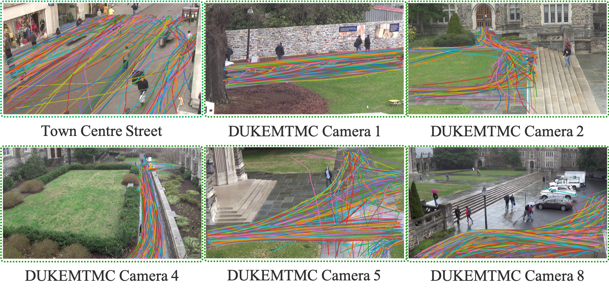

# trajCamPose

In this project, we proposed a method to estimated the 3D camera pose (of a static surveillance camera) from 2D pedestrian trajectories.  We have access to a rough estimation of the real camera pose, generate synthetic pedestrian trajectories for training our regressor, apply the trained regressor with pedestrian extracted from real surveillance video.

A visualization of the real ground plane and the re-projected ground plane is presented in the following figure.

<!--  -->


<!-- The code was written by [Yan Xu](https://github.com/yanx001). -->

## Prerequisites
Linux or MacOS
Python 3.6+
CPU or NVIDIA GPU + CUDA CuDNN

## Tutorial

### Generate synthetic data
As a first step, we first generate synthetic training data, given an estimated initial camera pose.  The camera name is specified in the "data_root".

```
python generate_data.py --data_root 'experiments/towncenter' --traj_num 10 -- traj_len 31
```
<!-- 
Pedestrian trajectories extracted from real videos and synthetic trajectories generated from our simulator are illustrated in the following figure.

{ width=50% }

Real test scenes and test trajectories are shown in the following figure.

 -->

### Train

```
python train.py --data_root 'experiments' --beta 500 --checkpoints_dir 'experiments/checkpoints' --num_epoch 100
```

### Test

```
python test.py --data_root 'experiments/towncenter'
```
